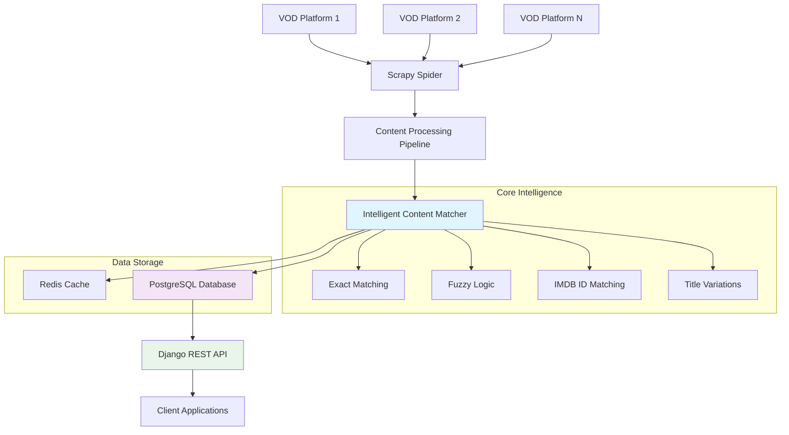
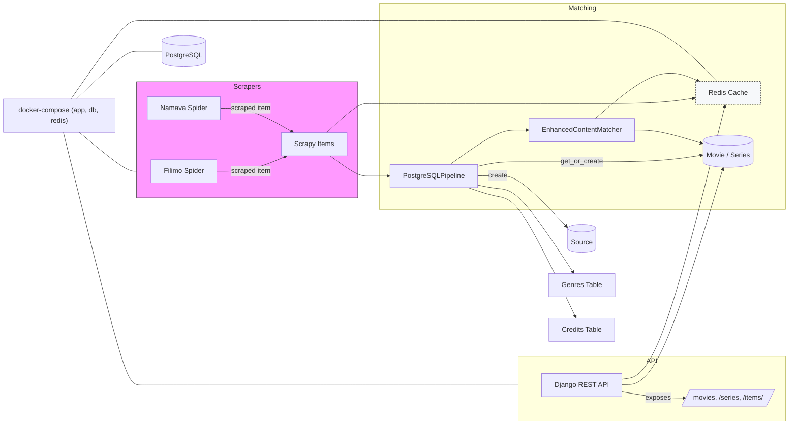

# 🎬  VOD Scraper

A sophisticated data pipeline that intelligently crawls multiple Video-on-Demand platforms, normalizes content metadata, and exposes unified data through a RESTful API with advanced content matching capabilities.

---

## Architecture




---


### 🔧 Run
```bash
git clone ...
cd vod_scraper
```
Then:
```bash
make env
make build
make up
```
then you can enjoy the app. <br />

### 🌐 Endpoints

```bash
curl http://localhost:8000/movies/
```

```bash
curl http://localhost:8000/series/
```
```bash
curl http://localhost:8000/items/<id>/
```
